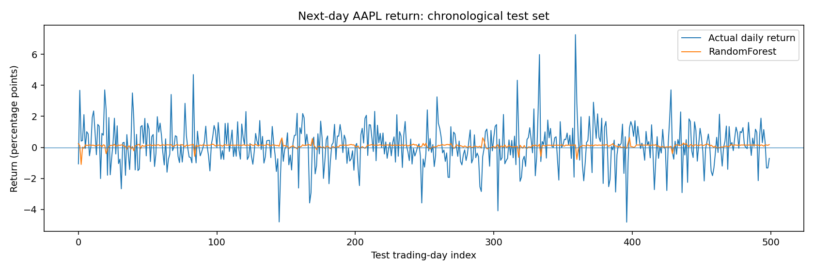
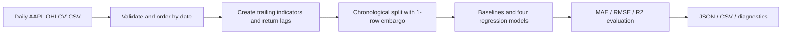

# AAPL Return Forecasting — Classical ML Benchmark

**A reproducible educational ML project comparing four regression models on historical stock-market data.** Built from my first-year coursework on machine-learning methods for financial-asset analysis.

> **Status:** End-to-end experiment reproduced on the provided 2015–2024 AAPL CSV; local results, evaluation scripts, tests and CI included. The third-party price dataset itself is **not** redistributed. Educational research only — **not** a trading system or investment advice.

## At a glance

| | |
|---|---|
| **Problem** | Predict next trading day's close-to-close **percentage return**, not the absolute share price |
| **Models** | Linear Regression · Decision Tree · Random Forest · Gradient Boosting |
| **Baselines** | Predict zero return · Predict historical training-mean return |
| **Features** | Moving-average ratios, returns, intraday range, three return lags, volume |
| **Validation** | 80/20 chronological holdout, no shuffling, one-observation embargo |
| **Metrics** | MAE, RMSE (percentage points), and R² |
| **Stack** | Python, pandas, NumPy, scikit-learn, Matplotlib, pytest |

## Why this is interesting

Financial returns are noisy and hard to forecast. A small MAE by itself is **not** evidence of an effective prediction model; simple baselines can achieve similar results. This repository makes baselines and R² first-class outputs and keeps model selection separate from any claim of predictive or financial usefulness.

## Reproduced results on real AAPL data

The experiment was **executed on the supplied CSV** (2,516 dated rows, 2015-01-02 through 2024-12-31), not on synthetic samples. Features produce 2,496 usable rows. Chronological evaluation uses **1,995 training rows, a 1-row embargo, and 500 test rows**. The main score table comes from the updated research implementation, not the original notebook.

| Model | MAE (pp) ↓ | RMSE (pp) ↓ | R² ↑ |
|---|---:|---:|---:|
| **Training-mean baseline** | **1.0007** | **1.3456** | **−0.0015** |
| Zero-return baseline | 1.0091 | 1.3527 | −0.0121 |
| Random Forest | 1.0106 | 1.3556 | −0.0165 |
| Decision Tree | 1.0170 | 1.3729 | −0.0426 |
| Linear Regression | 1.0181 | 1.3644 | −0.0296 |
| Gradient Boosting | 1.0745 | 1.4232 | −0.1203 |

**Finding:** Random Forest has the lowest MAE *among the four ML regressors*, but **none of the ML models beats the training-mean baseline** on this single chronological holdout. All model R² values are negative. This is an important negative result, not a demonstrated forecast or trading edge.



[Read the reproducibility report](docs/reproduced-results.md) · [Machine-readable metrics](results/metrics.json) · [Model score CSV](results/model_metrics.csv) · [Residual chart](results/residuals.png) · [Random Forest feature importance](results/feature_importance.png)

**Data:** The source CSV is not committed. This run used the same uploaded file as the coursework experiment; the PDF cites a Kaggle dataset, but independent provenance/redistribution rights have not been verified. See the report for the input checksum and environment details.

## Original coursework (public PDF)

[**Read the anonymized coursework report (PDF, 27 pages)**](docs/coursework.pdf)

This is a public portfolio edition of my 2026 Russian-language university coursework.
The original signed university title/assignment pages were removed and replaced
with an English cover and research overview. **The original research body,
figures, calculations, references, and printed Python listing (pages 3-27)
were preserved without modification.**

The report's historical model scores are **not** new, independently reproduced
results of this GitHub codebase. The repository provides a separate engineering
rewrite with more explicit baseline comparisons, validation, tests, and CLI.

## Pipeline



Features are computed using data available **by the close of day t**. The target is the percentage close-to-close return from t to the next trading day. Models are fit on earlier dates and evaluated on later, unseen dates. `StandardScaler` is fit only inside the training pipeline for linear regression; tree-based models receive unscaled features.

## Run locally

Python **3.11+** required. Windows PowerShell examples:

```powershell
# In this repository's root directory:
uv sync --python 3.13 --extra dev
uv run --extra dev python -m pytest -q
```

Without `uv`, use Python and pip:

```powershell
python -m pip install -e ".[dev]"
python -m pytest -q
```

Download the AAPL CSV referenced in [data/README.md](data/README.md), check its terms of use, and save it locally to `data/AAPL_stock_2015_2025.csv` (the `data/` files are Git-ignored).

```powershell
uv run python -m aapl_forecasting.experiment --csv data/AAPL_stock_2015_2025.csv --out outputs
```

**To verify the code without the real dataset**, use generated synthetic data:

```powershell
uv run python scripts/create_demo_csv.py
uv run python -m aapl_forecasting.experiment --csv data/demo_synthetic.csv --out outputs/demo --start 2018-01-01 --end 2019-12-31
```

Synthetic outputs are only smoke tests. **Do not describe them as AAPL results.**

## Outputs

| File | What it contains |
|---|---|
| `outputs/metrics.json` | Dataset period, sample sizes, validation protocol, metrics, baseline comparison |
| `outputs/predictions.csv` | Dates, actual returns and model predictions |
| `outputs/forecast.png` | Best-MAE candidate and actual out-of-sample returns |
| `outputs/residuals.png` | Residuals on the chronological holdout |
| `outputs/feature_importance.png` | Impurity-based feature importance for Random Forest (not causal evidence) |

`outputs/` is local and Git-ignored. Selected metrics and figures from the real-data run are published under [`results/`](results/) for auditability. Individual daily predictions and the raw third-party price data are **not** distributed.

## What changed since my original coursework

This is an **engineering rewrite** of my first-year university project. Its updated experiment was separately executed with the provided AAPL CSV and produced scores close to the original coursework, with a one-row boundary embargo and explicit baseline comparisons. It adds input validation, deterministic code, an sklearn scaling pipeline, an explicit one-row holdout boundary embargo, baseline regressors, R², automated tests, a CLI, machine-readable results, and CI.

The public-edition [coursework PDF](docs/coursework.pdf) preserves the original printed code listing. The executable Python package here is a separate engineering rewrite: typesetting and line-break artifacts in the original report make its printed listing unsuitable for direct execution.

## Important limitations and next steps

- Only one chronological holdout is currently used. **Walk-forward backtesting** and hyperparameter selection on prior validation windows are needed before drawing stronger conclusions.
- Historical returns are noisy; negative R² or failure to beat a naive baseline should be reported openly.
- Impurity-based feature importance does not prove causality or financial signal.
- Results depend on the exact CSV vendor, adjustments, observation window, and cleaning rules.
- No transaction costs, slippage, risk controls, or profitability analysis are included.
- A future experiment may add time-series cross-validation, uncertainty estimates, and transaction-cost-aware baselines.

## Repository structure

```text
src/aapl_forecasting/       data loading, features, experiment CLI
tests/                      data, leakage boundary and output tests
scripts/                    synthetic CSV generator for smoke testing
data/README.md              original data source and expected schema
docs/                       anonymized coursework, reproducibility report, research notes
results/                    checked-in aggregate metrics and curated plots (no source CSV)
.github/workflows/ci.yml    automated lint and tests
```

## Origin and license

Adapted and expanded from my 2026 first-year coursework: *Development of Intelligent Algorithms for Asset Valuation and Price Forecasting*. The underlying historical dataset is third-party material and is not redistributed. Source code: MIT License.
