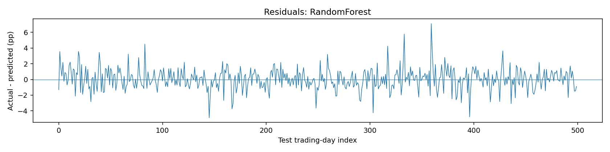
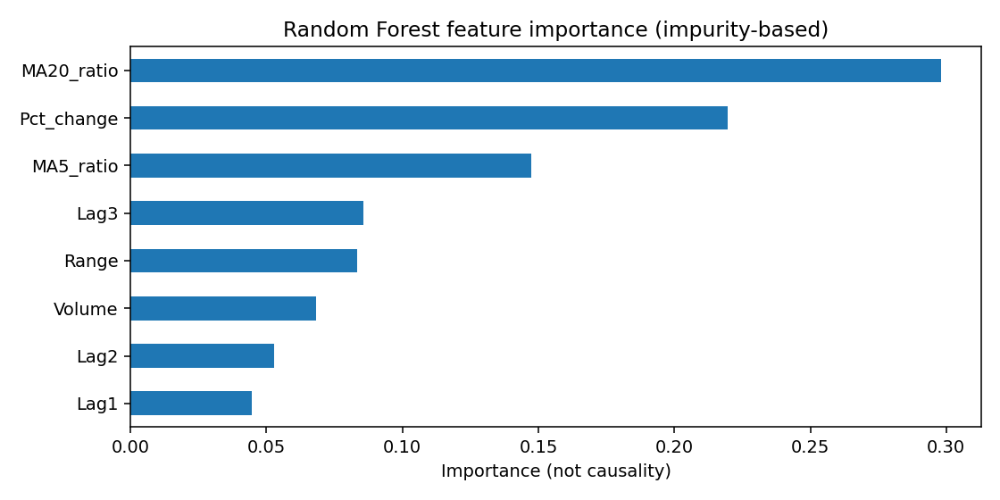

# Real-data reproduction — AAPL Return Forecasting

## Summary

This page documents an independent execution of the repository's Python experiment using the CSV supplied with the original coursework project. It is **not** a claim that the model produces profitable trades. The third-party CSV itself is deliberately not republished.

- Input filename: `AAPL_stock_2015_2025.csv`
- SHA-256: `fb0f8422ef10135b88c06ef7165a12df41c68167c1c840d8a116d2dc589bc631`
- Dated observations: **2,516**, covering **2015-01-02** through **2024-12-31** (the second non-data ticker row was ignored).
- Target: next trading day's *close-to-close percentage return*, measured in percentage points.
- Usable rows after lag and window feature creation: **2,496**.
- Chronological holdout: **1,995 train / 1 skipped boundary / 500 test**; no shuffle.
- Last training feature date: **2022-12-30**; first test feature date: **2023-01-04**; last test feature date: **2024-12-30**. Each test label refers to the next trading session.
- Eight features: `MA5_ratio`, `MA20_ratio`, `Pct_change`, `Range`, `Lag1`, `Lag2`, `Lag3`, `Volume`.
- Model seed: `42`; Random Forest 300 trees, `max_depth=4`, `min_samples_leaf=20`.

## Evaluation results

| Model | MAE (pp) ↓ | RMSE (pp) ↓ | R² ↑ |
|---|---:|---:|---:|
| **Training-mean baseline** | **1.0007** | **1.3456** | **−0.0015** |
| Zero-return baseline | 1.0091 | 1.3527 | −0.0121 |
| Random Forest | 1.0106 | 1.3556 | −0.0165 |
| Decision Tree | 1.0170 | 1.3729 | −0.0426 |
| Linear Regression | 1.0181 | 1.3644 | −0.0296 |
| Gradient Boosting | 1.0745 | 1.4232 | −0.1203 |

The MAE / RMSE values here are **percentage points**, not absolute prices or conventional percent errors. Best ML candidate by MAE is Random Forest (1.0106 pp). Best among simple baselines is the training mean (1.0007 pp). The additional modeling complexity **did not improve** holdout MAE over that baseline. Negative R² values indicate that the models also fail to exceed a constant predictor based on the test-set mean under that metric.

## Figures






Feature importance reflects tree impurity reductions, **not causation**, and does not prove reliable financial signal. This plot was computed from the fitted Random Forest on the training split.

## Reproduce the run on Windows (PowerShell)

First place the separately obtained dataset at `data/AAPL_stock_2015_2025.csv` inside the repository. Check the data provider's terms and the CSV checksum above; input variants may have different price adjustments.

```powershell
uv sync --python 3.13 --extra dev
uv run --extra dev python -m pytest -q
uv run --extra dev ruff check .
uv run python -m aapl_forecasting.experiment --csv data/AAPL_stock_2015_2025.csv --out outputs
```

Outputs are written to `outputs/` and are intentionally Git-ignored. Public `results/` is a reviewed snapshot: JSON metrics, an aggregate CSV and diagnostic charts, not daily price data or row-level predictions.

## Environment used for this reproduction

- Python 3.11+ compatible project; result run conducted using installed packages: pandas `2.2.3`, NumPy `2.3.5`, scikit-learn `1.8.0`, Matplotlib `3.10.8`.
- Results may differ slightly with other libraries, especially the latest scikit-learn versions.
- One chronological holdout only. There is no walk-forward validation, trading simulation, transaction cost, slippage, market impact or profitability analysis.

## Why the scores differ slightly from the original notebook

The original supplied `Untitled-1.ipynb` split the same 2,496 feature rows as 1,996 train and 500 test, without excluding the boundary row. Running its two specified tree models produced:

| Original notebook model | MAE (pp) | RMSE (pp) | R² |
|---|---:|---:|---:|
| Decision Tree | 1.016961 | 1.372919 | −0.042534 |
| Random Forest | 1.010464 | 1.355551 | −0.016324 |

The engineering rewrite excludes one boundary training row whose next-day target touches the first test day's feature timestamp. With that additional precaution, the Random Forest MAE is **1.010615** rather than 1.010464. This is a small, expected protocol change, not a claim that the original notebook and this program are identical.

## Source and rights

The original university PDF cites an AAPL dataset on Kaggle: <https://www.kaggle.com/datasets/saibhossain/apple-aapl-stock-prices-20152025>. The provided CSV resembles an OHLCV export with one ticker/metadata header row. The link in the PDF is recorded as historical provenance, **not independently verified provenance or a redistribution license** for the supplied CSV. Therefore the raw CSV and row-level predictions are not included in this release.
